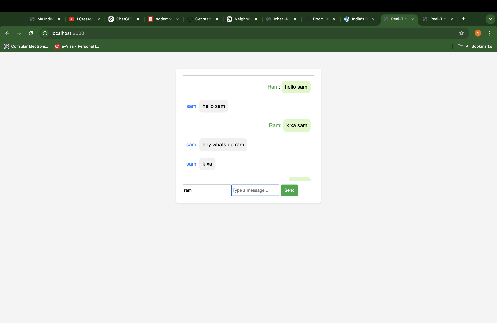

# Real-Time Chat Application

A simple real-time chat application built with Node.js, Express, and Socket.IO. This application allows multiple users to chat with each other in real time.

## Features

- users can message to each other in real time
- Unique usernames for each user
- Responsive user interface
- Light and dark theme options

## Technologies Used

- **Frontend**: HTML, CSS, JavaScript
- **Backend**: Node.js, Express
- **Real-time Communication**: Socket.IO

## Installation

1. **Clone the Repository**:
   ```bash

2. navigate project directory or path
  cd real-time-chat-app
3.  instal needed dependencies
  using npm install
4. start your main server
  node server.js
5  visit browser using 
  http://localhost:3000 to access the chat application.
 
## your UI looks like 
   
